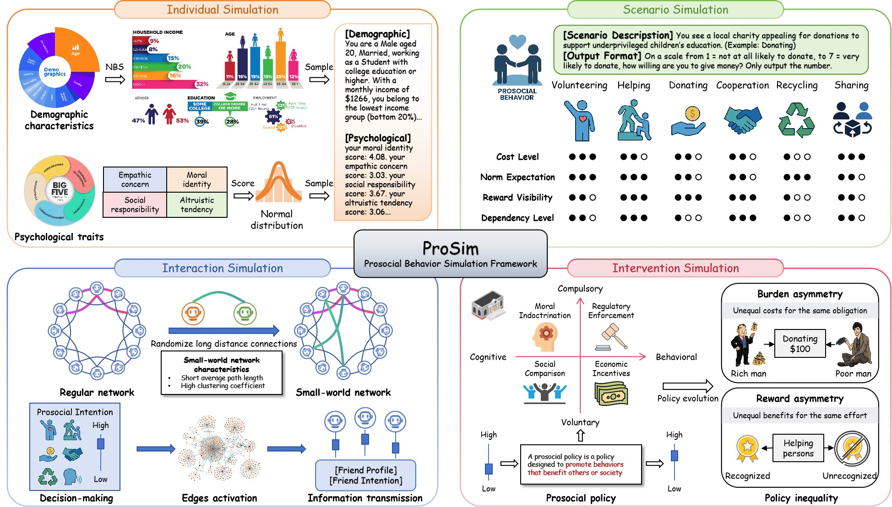

# Simulating Prosocial Behavior and Social Contagion in LLM Agents under Institutional Interventions

This repository contains the official code and documentation for our paper, titled "[Simulating Prosocial Behavior and Social Contagion in LLM Agents under Institutional Interventions](url)."



## Install Environment

To set up the environment and dependencies, run the following commands:

```bash
conda create -n ProSim python=3.10

pip install torch==2.5.1 torchvision==0.20.1 torchaudio==2.5.1 --index-url https://download.pytorch.org/whl/cu118

pip install -r requirements.txt
```


## Running the Experiments

### Study 1: Prosocial Behavior

```
python prosocial_behavior.py
```

#### Parameters

| **Parameter**       | **Type** | **Description**                                              |
| ------------------- | -------- | ------------------------------------------------------------ |
| `--model_name`      | `str`    | The name of the model to be used in the experiment.          |
| `--use_local_model` | `bool`   | If set, the local version of the model will be used.         |
| `--max_new_tokens`  | `int`    | The maximum number of tokens that can be generated in a single response by the local model. |
| `--temperature`     | `int`    | Default: 1.                                                  |
| `--num_threads`     | `int`    | The number of threads to use for parallel execution.         |
| `--output_reason`   | `bool`   | If set, the model will provide reasoning along with the generated response. |
| `--num_agents`      | `int`    | The number of LLM agents involved in the experiment.         |
| `--policy`          | `str`    | The policy that governs the agents' behavior. Choices include `"moral"`, `"social"`, `"enforce"`, `"economic"`. |
| `--chara_file_path` | `str`    | The path to the file containing the agents' character data.  |
| `--max_attempts`    | `int`    | The maximum number of attempts per dialogue.                 |

> **Note**: Parameters that are shared across studies (e.g., --model_name, --num_agents, etc.) are only documented in Study 1 for brevity.

### Study 2: Third-Party Punishment

```
python third_party_punishment.py
```

#### Parameters

| **Parameter**  | **Type** | **Description**                                    |
| -------------- | -------- | -------------------------------------------------- |
| `--num_rounds` | `int`    | The number of rounds each agent plays in the game. |

### Study 3: Inequity Information Spread with Prosocial Context

```
python inequality_info_spread.py
```

#### Parameters

| **Parameter**               | **Type** | **Description**                                              |
| --------------------------- | -------- | ------------------------------------------------------------ |
| `--explicit_spread`         | `bool`   | If set, the experiment will explicitly spread unfair information. |
| `--history_action`          | `bool`   | If set, the prompt will include the historical actions of each agent. |
| `--rate_inequality`         | `bool`   | IIf set, the agent will also output its perception of inequality. |
| `--num_rounds`              | `int`    | The number of iterations agents will participate in during the experiment. |
| `--activation_rate`         | `float`  | The probability of activating edges in the small-world network during each round of the experiment. |
| `--inequality_agent_counts` | `int`    | The initial number of agents that perceive inequality.       |
| `--inequality`              | `str`    | The type of inequality being simulated in the experiment.    |
| `--chara_detail_file_path`  | `str`    | The file path for the agent's detailed data.                 |
| `--swn_file_path`           | `str`    | The file path for the small-world network data.              |


## Citation

If you use this code or results in your work, please cite the following paper:

```
@article{zhou2025simulating,
  title={Simulating Prosocial Behavior and Social Contagion in LLM Agents under Institutional Interventions},
  author={Zhou, Yujia and Wang, Hexi and Ai, Qingyao and Wu, Zhen and Liu, Yiqun},
  journal={arXiv preprint arXiv:2505.15857},
  year={2025}
}
```

